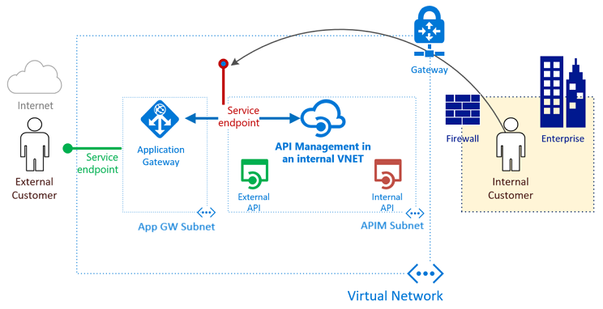

# App Service

> Demo 0 : App Service Plan & Scale

> Demo 1 : Upload app file
> Demo 2 : Auto Swap
> Demo 2 : Visual Studio deploy app
    - Config
    - Extension

> Demo 3 : Kudo

> Demo 4 : API Management

> Demo 5 : Azure DevOps with App Service
    - Version Control System(VCS)
    - Continuous integration
    - Continuous Deployment

> Demo 6 : App Service Best Practices

# Container Service

> Demo 0 : Azure Kubernetes Engine

> Demo 1 : ACR + AKS
 - ASK Scale and upgrade
> Demo 2 : Azure DevOps with ACS

> Demo 3  : AKS Best Practices
