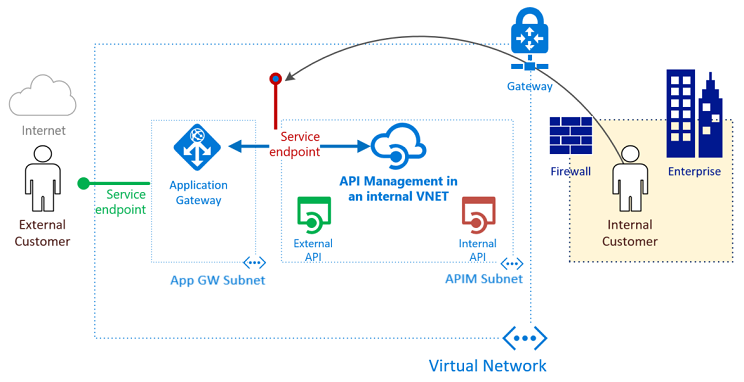
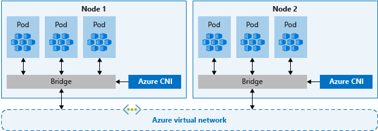
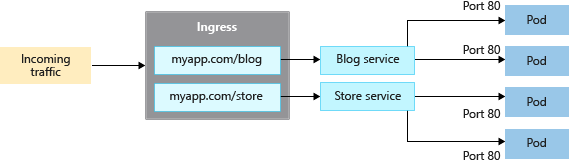
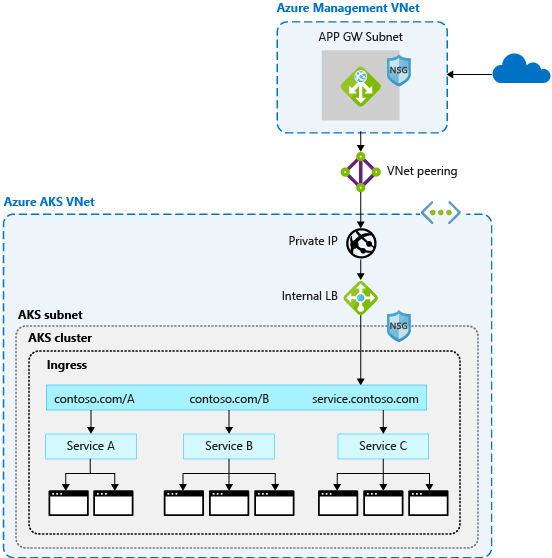

# App Service

> Demo 0 : App Service Plan & Scale

> Demo 1 : Upload app file
> Demo 2 : Auto Swap
> Demo 2 : Visual Studio deploy app
    - Config
    - Extension

> Demo 3 : Kudo

> Demo 4 : API Management

> Demo 5 : Azure DevOps with App Service
    - Version Control System(VCS)
    - Continuous integration
    - Continuous Deployment

> Demo 6 : App Service Best Practices
- 共同放置区域 Colocation 
- 应用服务自动修复功能
- Auto Scale

# Container Service

> Demo 0 : Azure Kubernetes Engine
# Demo AKS_Engine

## Create Service Principal
az ad sp create-for-rbac --role="Contributor" --scopes="/subscriptions/6500a4b3-d5f9-4ef4-a764-5d6360780b0b/resourceGroups/AKS_Engine_Demo1"

## Edit Kubenetes.json 
- servicePrincipalProfile param 

##Generate ARM Template
./aks-engine generate --api-model Kubernetes.json

## Deployment Azure Resource by ARM Template
az group deployment create --name=aksengine --resource-group=AKS_Engine_Demo1  --template-file=azuredeploy.json --parameters=azuredeploy.parameters.json

<!--
kubectl run nginx --image nginx
kubectl expose deployment nginx --port=80
kubectl get pods
kubectl edit svc/nginx
kubectl get services
-->

> Demo 1 : ACR + AKS
## Create Resource Group
`az group create -l eastus --name ACSDemo`
## Clone App
`git clone https://github.com/Azure-Samples/azure-voting-app-redis.git`
`cd azure-voting-app-redis`
## Docker compose for defining and running multi-container
`Docker-compose up -d`
`Docker ps`
[http://localhost:8080/](http://localhost:8080/)

## Create ACR (Azure Container Registry)
`az acr create --resource-group ACSDemo --name ACSDemoACR --sku Basic`
## ACR login
`az acr login --name ACSDemoACR`
## Docker login
`docker login -u ACSDemoACR -p +DrllUBGxvbPqgHCc0cb+dKH9VUlUnBt acsdemoacr1.azurecr.io`
## Docker tag
`docker tag azure-vote-front acsdemoacr.azurecr.io/azure-vote-front:v1`
## Docker push
`docker push acsdemoacr.azurecr.io/azure-vote-front:v1`
## Show ACR images
`az acr repository list --name ACSDemoACR --output table`
## Create Azure Kubernetes Service
`az aks create --resource-group ACSDemo --name AKSCluster --node-count 1 --generate-ssh-keys`
## Get ASK Credentials
`az aks get-credentials --resource-group ACSDemo --name AKSCluster`
`kubectl get nodes`
## ACR and AKS role assignment
`CLIENT_ID=$(az aks show --resource-group ACSDemo --name AKSCluster1 --query "servicePrincipalProfile.clientId" --output tsv)`
`ACR_ID=$(az acr show --name ACSDemoACR --resource-group ACSDemo --query "id" --output tsv)`
`az role assignment create --assignee $CLIENT_ID --role Reader --scope $ACR_ID`
## 修改azure-vote-all-in-one-redis.yaml
`acsdemoacr.azurecr.io/azure-vote-front:v1`

`kubectl apply -f azure-vote-all-in-one-redis.yaml`
`kubectl get service`

> Demo 3  : AKS Best Practices
[设计多租户群集,群集隔离](https://docs.microsoft.com/zh-cn/azure/aks/operator-best-practices-cluster-isolation)

容器网络接口 CNI

分配入口流量

应用程序防火墙 (WAF) 保护流量

存储和备份

[Storage + DR](https://docs.microsoft.com/zh-cn/azure/aks/operator-best-practices-storage)

[业务连续性和灾难恢复](https://docs.microsoft.com/zh-cn/azure/aks/operator-best-practices-multi-region)

# 反饋

> Feedback

> Question

